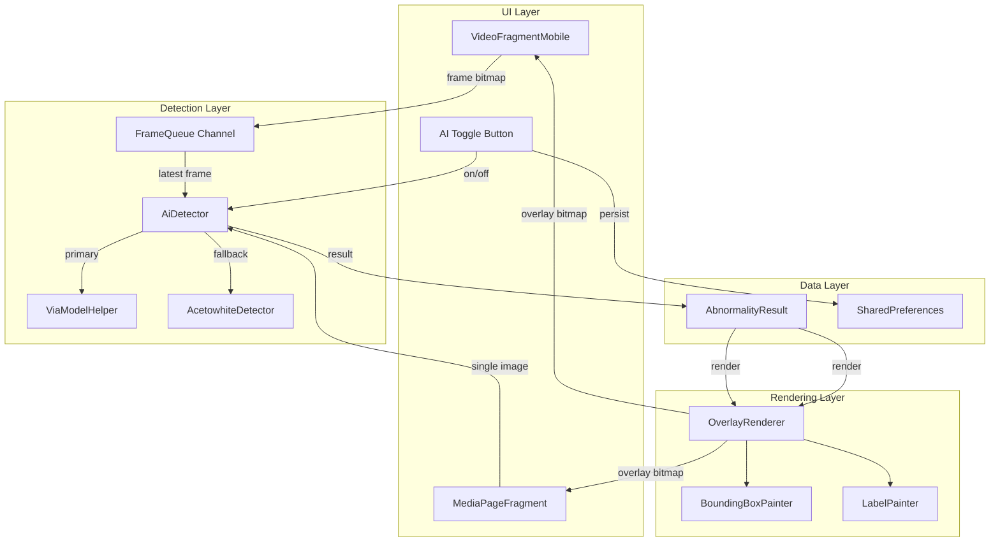
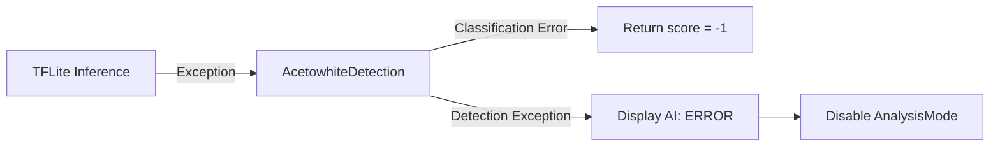

# Design Document: AI Abnormality Detection

## Overview

Fitur AI Abnormality Detection menambahkan kemampuan analisis kecerdasan buatan ke aplikasi Cervexa untuk mendeteksi area abnormal pada gambar serviks menggunakan metode VIA (Visual Inspection with Acetic Acid). Sistem ini terintegrasi ke dua konteks: **live streaming** (RTSP real-time) dan **galeri media** (gambar/video tersimpan).

Arsitektur dibangun di atas komponen `ViaModelHelper` yang sudah ada, dengan penambahan layer abstraksi untuk:
- Manajemen lifecycle inferensi (threading, queue, memory)
- Rendering overlay (bounding box, label, confidence score)
- Fallback ke deteksi acetowhite berbasis warna
- Toggle aktivasi per sesi

### Design Decisions

1. **Single-thread inference with frame dropping** — Alih-alih multi-thread inference yang kompleks, digunakan satu background thread dengan mekanisme drop frame lama (max queue 3) untuk menjaga latensi rendah tanpa memory leak.
2. **Shared OverlayRenderer** — Satu komponen renderer digunakan baik di live stream maupun galeri, memastikan konsistensi visual.
3. **Sealed class untuk result** — `AbnormalityResult` menggunakan sealed class Kotlin untuk type-safe handling antara Success, Fallback, dan Error states.
4. **Coroutines over RxJava** — Proyek sudah menggunakan `kotlinx-coroutines`, sehingga inference pipeline menggunakan `Dispatchers.Default` + `Channel` untuk frame queue.

---

## Architecture



### Alur Data Live Stream

1. `RtspImageView` menghasilkan frame `Bitmap`
2. Frame dikirim ke `FrameQueue` (Kotlin `Channel` capacity 3, `DROP_OLDEST`)
3. Coroutine consumer mengambil frame terbaru dari channel
4. `AiDetector` menjalankan inferensi via `ViaModelHelper` atau fallback `AcetowhiteDetector`
5. Hasil `AbnormalityResult` dikirim ke `OverlayRenderer`
6. `OverlayRenderer` menggambar overlay pada bitmap dan mengembalikan ke UI

### Alur Data Galeri

1. User menekan tombol "Analisis AI" pada gambar
2. Gambar di-decode dan divalidasi (min 64x64)
3. `AiDetector` menjalankan inferensi pada `Dispatchers.Default`
4. Hasil ditampilkan via `OverlayRenderer` di atas `PhotoView`
5. User dapat menghapus overlay untuk kembali ke gambar asli

---

## Components and Interfaces

### AbnormalityResult (Sealed Class)

```kotlin
sealed class AbnormalityResult {
    data class Detected(
        val label: Classification,
        val confidenceScore: Float,       // 0.0 - 1.0
        val boundingBox: RectF?,          // null jika NORMAL
        val isFallback: Boolean = false
    ) : AbnormalityResult()

    data class Error(
        val message: String,
        val errorCode: Int = -1
    ) : AbnormalityResult()

    object Idle : AbnormalityResult()
}

enum class Classification { NORMAL, ABNORMAL }
```

### AiDetector

```kotlin
class AiDetector(
    private val context: Context,
    private val viaModelHelper: ViaModelHelper,
    private val acetowhiteDetector: AcetowhiteDetector
) {
    private val frameChannel = Channel<Bitmap>(capacity = 3, onBufferOverflow = BufferOverflow.DROP_OLDEST)
    private var analysisJob: Job? = null
    private val _result = MutableStateFlow<AbnormalityResult>(AbnormalityResult.Idle)
    val result: StateFlow<AbnormalityResult> = _result.asStateFlow()

    fun startAnalysis(scope: CoroutineScope) { ... }
    fun stopAnalysis() { ... }
    fun submitFrame(bitmap: Bitmap) { ... }
    suspend fun analyzeImage(bitmap: Bitmap): AbnormalityResult { ... }
    fun validateImage(width: Int, height: Int): String? { ... }
}
```

### AcetowhiteDetector

```kotlin
class AcetowhiteDetector {
    fun detect(bitmap: Bitmap): AbnormalityResult.Detected { ... }

    companion object {
        const val MIN_R = 150
        const val MIN_G = 150
        const val MIN_B = 130
        const val MAX_CHANNEL_DIFF = 45
        const val ABNORMAL_RATIO_THRESHOLD = 0.15f
        const val SAMPLE_STEP = 5
    }
}
```

### OverlayRenderer

```kotlin
class OverlayRenderer {
    fun renderOverlay(
        source: Bitmap,
        result: AbnormalityResult.Detected,
        includeTimestamp: Boolean = false
    ): Bitmap { ... }

    fun calculateTextSize(frameHeight: Int): Float { ... }
    fun calculateStrokeWidth(frameWidth: Int): Float { ... }
    fun formatLabel(result: AbnormalityResult.Detected): String { ... }
    fun getLabelColor(result: AbnormalityResult.Detected): Int { ... }
}
```

### AnalysisModeManager

```kotlin
class AnalysisModeManager(private val prefs: SharedPreferences) {
    private val _isActive = MutableStateFlow(false)
    val isActive: StateFlow<Boolean> = _isActive.asStateFlow()

    fun toggle() { ... }
    fun activate() { ... }
    fun deactivate() { ... }
    fun persist() { ... }
    fun restore() { ... }
}
```

---

## Data Models

### AbnormalityResult Fields

| Field | Type | Description |
|-------|------|-------------|
| label | Classification | NORMAL atau ABNORMAL |
| confidenceScore | Float | 0.0–1.0, probabilitas abnormalitas |
| boundingBox | RectF? | Koordinat area abnormal (normalized 0-1), null jika NORMAL |
| isFallback | Boolean | true jika hasil dari AcetowhiteDetection |

### Classification Logic

| Condition | Label | Display Color |
|-----------|-------|---------------|
| score > 0.75 | ABNORMAL | Merah solid (#FF0000) |
| 0.5 < score ≤ 0.75 | ABNORMAL | Oranye (#FF8C00) |
| score ≤ 0.5 | NORMAL | Hijau (#00C853) |

### Display Percentage Calculation

- **ABNORMAL**: `XX = round(confidenceScore * 100)`
- **NORMAL**: `XX = round((1 - confidenceScore) * 100)`

### Acetowhite Pixel Criteria

Sebuah piksel diklasifikasikan sebagai acetowhite jika:
- R > 150 AND G > 150 AND B > 130
- |R - G| < 45 AND |G - B| < 45

### Acetowhite Confidence Mapping

```
confidenceScore = min(acetowhiteRatio / 0.15, 1.0)
```

Di mana `acetowhiteRatio = acetowhitePixelCount / totalSampledPixels` pada area tengah frame (25%–75% width dan height).

### SharedPreferences Keys

| Key | Type | Default | Description |
|-----|------|---------|-------------|
| `ai_analysis_mode_active` | Boolean | false | Status terakhir AnalysisMode |

---

## Correctness Properties

*A property is a characteristic or behavior that should hold true across all valid executions of a system — essentially, a formal statement about what the system should do. Properties serve as the bridge between human-readable specifications and machine-verifiable correctness guarantees.*

### Property 1: Inference output structure completeness

*For any* valid Bitmap input (width ≥ 64, height ≥ 64), when `AiDetector.analyzeImage()` returns a `Detected` result, it SHALL always contain a non-null `label` (NORMAL or ABNORMAL), a `confidenceScore` in the range [0.0, 1.0], and coordinates (boundingBox non-null when ABNORMAL, null when NORMAL).

**Validates: Requirements 1.2**

### Property 2: Classification threshold and display formatting

*For any* confidence score `s` in [0.0, 1.0]:
- If `s > 0.5`, classification SHALL be ABNORMAL, displayed percentage SHALL equal `round(s * 100)`, and color SHALL be red when `s > 0.75` or orange when `0.5 < s ≤ 0.75`
- If `s ≤ 0.5`, classification SHALL be NORMAL, displayed percentage SHALL equal `round((1 - s) * 100)`, and color SHALL be green

**Validates: Requirements 1.3, 5.1, 5.2, 5.3**

### Property 3: Overlay visualization correctness

*For any* `AbnormalityResult.Detected`, when the label is ABNORMAL with confidence above threshold, the overlay SHALL contain a red/orange bounding box at the specified coordinates; when the label is NORMAL, the overlay SHALL contain a green indicator and no specific bounding box.

**Validates: Requirements 2.1, 2.2, 3.3**

### Property 4: Proportional overlay scaling

*For any* frame resolution (width, height) where width ≥ 320 and height ≥ 240, the text size, stroke width, and padding produced by `OverlayRenderer` SHALL be proportional to frame dimensions (i.e., `textSize / frameHeight` and `strokeWidth / frameWidth` remain within a constant ratio band regardless of resolution).

**Validates: Requirements 2.3**

### Property 5: Image size validation gate

*For any* image with width < 64 OR height < 64, `AiDetector.validateImage()` SHALL return a non-null error message and no inference SHALL be executed. For any image with width ≥ 64 AND height ≥ 64, validation SHALL return null (pass).

**Validates: Requirements 3.6**

### Property 6: AnalysisMode persistence round-trip

*For any* boolean value `v`, after calling `AnalysisModeManager.persist()` with state `v` and then `AnalysisModeManager.restore()`, the restored state SHALL equal `v`.

**Validates: Requirements 4.4**

### Property 7: Frame queue bounded size

*For any* sequence of N frames submitted to `AiDetector.submitFrame()` where N > 3, the internal channel SHALL contain at most 3 frames, and the oldest frames SHALL be dropped in favor of the most recent.

**Validates: Requirements 6.3**

### Property 8: Acetowhite detection algorithm correctness

*For any* bitmap, the `AcetowhiteDetector` SHALL:
1. Only sample pixels within the center region (25%–75% of width and height)
2. Classify a pixel as acetowhite if and only if R > 150 AND G > 150 AND B > 130 AND |R-G| < 45 AND |G-B| < 45
3. Compute confidence as `min(acetowhiteRatio / 0.15, 1.0)` where ratio = acetowhitePixels / totalSampledPixels

**Validates: Requirements 7.3, 7.4**

### Property 9: Fallback label indicator

*For any* `AbnormalityResult.Detected` where `isFallback == true`, the formatted label produced by `OverlayRenderer.formatLabel()` SHALL contain the substring "(Acetowhite)".

**Validates: Requirements 7.2**

---

## Error Handling

### Error Hierarchy

| Error Condition | Handling | User Feedback |
|----------------|----------|---------------|
| TFLite model gagal dimuat | Fallback ke AcetowhiteDetector | Label "(Acetowhite)" pada overlay |
| TFLite inference exception | Fallback ke AcetowhiteDetector | Label "(fallback)" pada overlay |
| Acetowhite classification gagal | Return confidenceScore = -1 | Log error, no crash |
| Acetowhite detection exception | Tampilkan "AI: ERROR" | Nonaktifkan AnalysisMode untuk sesi |
| Gambar tidak bisa di-decode | Tampilkan error message | "Gambar rusak atau format tidak didukung" |
| Gambar < 64x64 | Tampilkan error message | "Gambar terlalu kecil untuk dianalisis (minimum 64x64 piksel)" |
| Low memory | Nonaktifkan AnalysisMode | Notifikasi "AI dinonaktifkan: memori tidak cukup" |
| Interpreter close gagal | Log error, lanjutkan cleanup | Tidak ada feedback ke user |

### Fallback Chain



### Resource Cleanup

- `ViaModelHelper.close()` dipanggil di `onDestroyView()`
- Jika `Interpreter.close()` gagal, error di-log dan resource lain tetap dilepas
- `FrameQueue` channel di-cancel saat `stopAnalysis()`
- Bitmap di-recycle setelah diproses (tidak disimpan di memory)

---

## Testing Strategy

### Property-Based Testing

Library: **Kotest** dengan `kotest-property` module (Kotlin-native PBT framework yang sudah mature dan terintegrasi baik dengan JUnit).

Konfigurasi:
- Minimum 100 iterasi per property test
- Setiap test di-tag dengan referensi ke property di design document
- Format tag: `Feature: ai-abnormality-detection, Property {number}: {property_text}`

Property tests akan mencakup:
1. **Classification & formatting** — Generate random floats [0,1], verify label, percentage, dan color
2. **Acetowhite pixel classification** — Generate random RGB values, verify pixel classification
3. **Acetowhite ratio-to-score mapping** — Generate random ratios, verify score computation
4. **Image validation** — Generate random dimensions, verify accept/reject behavior
5. **AnalysisMode round-trip** — Generate random booleans, verify persistence
6. **Frame queue bounds** — Generate random frame sequences, verify max size
7. **Overlay scaling proportionality** — Generate random resolutions, verify proportional dimensions
8. **Output structure completeness** — Generate random bitmaps, verify result fields
9. **Fallback label formatting** — Generate random results with isFallback=true, verify label

### Unit Tests (Example-Based)

- Toggle AI on/off state transitions
- Fallback activation when model fails to load
- Error message display for corrupted images
- Low memory auto-disable behavior
- Interpreter cleanup on fragment destroy
- Snapshot includes overlay when AnalysisMode active

### Integration Tests

- End-to-end inference on sample VIA images
- Performance benchmark (< 200ms per frame)
- Frame rate measurement (≥ 5 FPS on target hardware)
- Video recording with overlay verification
- Report metadata includes AI results

### Test Dependencies

```gradle
// build.gradle (test dependencies)
testImplementation 'io.kotest:kotest-runner-junit5:5.8.0'
testImplementation 'io.kotest:kotest-assertions-core:5.8.0'
testImplementation 'io.kotest:kotest-property:5.8.0'
testImplementation 'io.mockk:mockk:1.13.8'
testImplementation 'org.jetbrains.kotlinx:kotlinx-coroutines-test:1.7.3'
```
